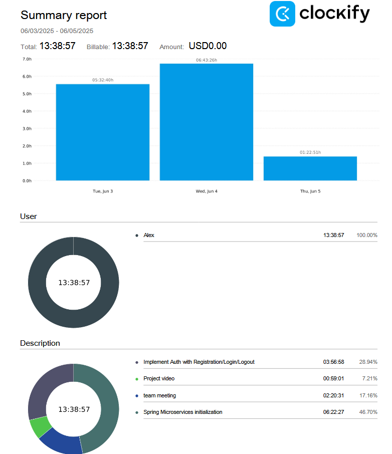
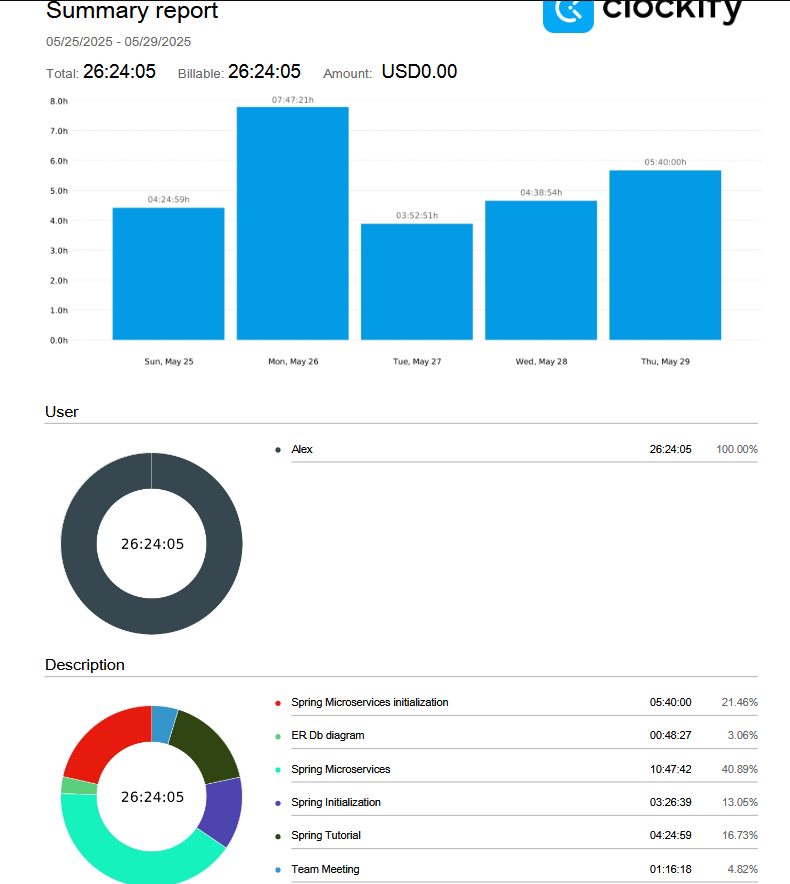
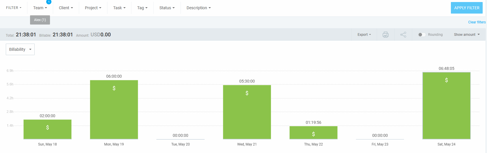

## Thursday (May 29-June 2)

### Timesheet
Clockify report

### Current Tasks (Provide sufficient detail)
  * #1: Getting auth working with login/registration/logout with JWT's and BCrypt.

### Progress Update (since May 29 2025) 
<table>
    <tr>
        <td><strong>TASK/ISSUE #</strong>
        </td>
        <td><strong>STATUS</strong>
        </td>
    </tr>
    <tr>
        <!-- Task/Issue # -->
        <td>Implement basic microservices architecture
        </td>
        <!-- Status -->
        <td>Complete
        </td>
    </tr>
    <tr>
        <!-- Task/Issue # -->
        <td>Design Video
        </td>
        <!-- Status -->
        <td>Complete
        </td>
    </tr>
</table>

### Cycle Goal Review (Reflection: what went well, what was done, what didn't; Retrospective: how is the process going and why?)
The final implementation I wanted for the basic microservices were finished with inter service communication, API Gateway, service discovery, and basic models of testing with Mockito and MockMvc for unit testing service layers and endpoints along with overall organization, error handling, DTO's, and basic database handling. 

### Next Cycle Goals (What are you going to accomplish during the next cycle)
  * Get registration to work with BCrypt for password hashing
  * Have login return JWT for auth that can also be checked in the gateway
  * Have logout destroy JWT and configure the rest of spring security for this to all work together

## Monday (May 29-June 2)

### Timesheet
Clockify report

### Current Tasks (Provide sufficient detail)
  * #1: Finishing basic microservices implementation - user service and course service now work and register in the in the eureka server. The API gateway also now has routing for the two services - now just need to further connect them.
  * #2: System architecture diagram

### Progress Update (since May 29 2025) 
<table>
    <tr>
        <td><strong>TASK/ISSUE #</strong>
        </td>
        <td><strong>STATUS</strong>
        </td>
    </tr>
    <tr>
        <!-- Task/Issue # -->
        <td>Implement basic microservices architecture
        </td>
        <!-- Status -->
        <td>80% complete
        </td>
    </tr>
    <tr>
        <!-- Task/Issue # -->
        <td>Architecture diagram
        </td>
        <!-- Status -->
        <td>Complete
        </td>
    </tr>
</table>

### Cycle Goal Review (Reflection: what went well, what was done, what didn't; Retrospective: how is the process going and why?)
A lot of progress was made for the microservices. The User service and course service are functioning now on their own ports, and implementing the basic spring MVC pattern to them worked well for the API calls. They register properly with Eureka, and today(Monday) I managed to get the API gateway to route to them properly.

### Next Cycle Goals (What are you going to accomplish during the next cycle)
  * Get the Feign client working for inter service communication
  * Implement many to many relationship between microservices
  * Write basic unit tests with Junit and Mockito for the API calls

## Thursday (May 24-29)

### Timesheet
Clockify report

### Current Tasks (Provide sufficient detail)
  * #1: Implementing a microservice architecture in spring boot. Involved watching video tutorials and starting the implementation on a branch.
  * #2: Helped create the ER diagram for the database model

### Progress Update (since May 24 2025) 
<table>
    <tr>
        <td><strong>TASK/ISSUE #</strong>
        </td>
        <td><strong>STATUS</strong>
        </td>
    </tr>
    <tr>
        <!-- Task/Issue # -->
        <td>Implement basic microservice architecture
        </td>
        <!-- Status -->
        <td>50% complete
        </td>
    </tr>
    <tr>
        <!-- Task/Issue # -->
        <td>ER Diagram
        </td>
        <!-- Status -->
        <td>Complete
        </td>
    </tr>
</table>

### Cycle Goal Review (Reflection: what went well, what was done, what didn't; Retrospective: how is the process going and why?)
I watched a number of videos on microservices in the spring boot and how to implement them. I understand fundamentally now how they work, and it's just a matter now of following the documentation and tutorials to get them communicating.

### Next Cycle Goals (What are you going to accomplish during the next cycle)
  * Get the microservices basic implementation working, including the service registry, gateway, and some basic services
  * Complete any missing diagrams i.e. an architecture diagram

## Sunday (May 18-24)

### Timesheet
Clockify report

### Current Tasks (Provide sufficient detail)
  * #1: Reading various modules on canvas and exploring some frameworks for potential use including Laravel, Spring Boot, and React
  * #2: Watching Youtube Tutorials on Spring Boot framework, here are the links for reference. 
    - [Part 1 intro spring](https://www.youtube.com/watch?v=gJrjgg1KVL4m)
    - [Part 2 intro spring](https://www.youtube.com/watch?v=EWd3_I4X32g)
    - [Intro spring and spring data jpa](https://www.youtube.com/watch?v=5rNk7m_zlAg)
    - [Intro to microservices in spring](https://www.youtube.com/watch?v=lh1oQHXVSc0)
  * #3: This time also included reviewing Pull Requests and team meetings

### Progress Update (since May 18 2025) 
<table>
    <tr>
        <td><strong>TASK/ISSUE #</strong>
        </td>
        <td><strong>STATUS</strong>
        </td>
    </tr>
    <tr>
        <!-- Task/Issue # -->
        <td>Project Plan
        </td>
        <!-- Status -->
        <td>99% complete
        </td>
    </tr>
    <tr>
        <!-- Task/Issue # -->
        <td>Learning Spring Boot
        </td>
        <!-- Status -->
        <td>Complete, mostly
        </td>
    </tr>
    <tr>
        <!-- Task/Issue # -->
        <td>Team Charter
        </td>
        <!-- Status -->
        <td>Complete
        </td>
    </tr>
</table>

### Cycle Goal Review (Reflection: what went well, what was done, what didn't; Retrospective: how is the process going and why?)
 I pretty much understand the Spring Boot framework and it's major components and organizational structure. Microservices on the other hand...definitely more complicated, and for this use case, I'm not sure it's worth exploring too much further.

### Next Cycle Goals (What are you going to accomplish during the next cycle)
  * Complete Diagrams for next milestone
  * Get a working Spring Boot backend, either monolithic or microservices once the group reaches consensus
  * Add the user stories and issues to Github from our project plan for tracking
