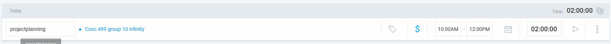
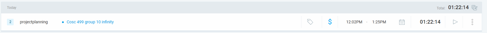
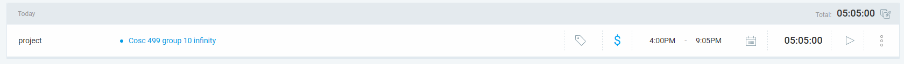
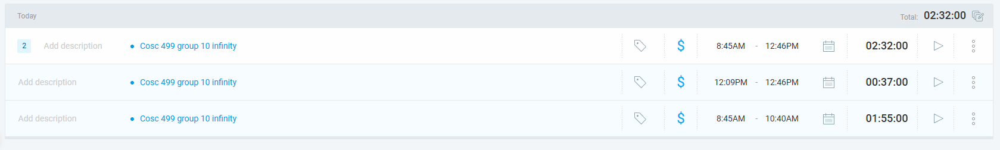
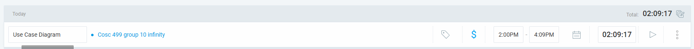
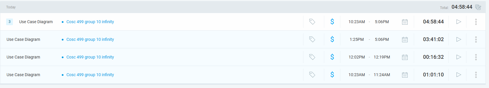
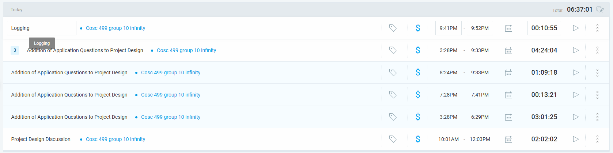
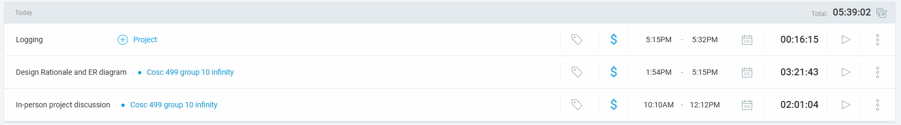

## Wednesday 5/21 (5/21~5/27)

### Timesheet
Clockify report

### Current Tasks (Provide sufficient detail)
  * #1: Project Planning

### Progress Update (since 5/21/2025) 
<table>
    <tr>
        <td><strong>TASK/ISSUE # 1</strong>
        </td>
        <td><strong>STATUS</strong>
        </td>
    </tr>
    <tr>
        <!-- Task/Issue # -->
        <td>Task 1
        </td>
        <!-- Status -->
        <td>In Progress
        </td>
    </tr>
</table>

### Cycle Goal Review (Reflection: what went well, what was done, what didn't; Retrospective: how is the process going and why?)
I met with my other teammates. We worked on the User requirements. We got done the functional requirements and the non-functional requirements. We roughly wrote some information for the rest of the document. But the rest of the document is not complete. 

### Next Cycle Goals (What are you going to accomplish during the next cycle)
  * Complete the rest of the document of Project Planning with my teammates. Complete  technical requirements, tech stack, high-level risks, assumptions and constraints,summary milestone schedule, teamwork planning

## Thursday 5/22 (5/21~5/27)

### Timesheet
Clockify report

### Current Tasks (Provide sufficient detail)
  * #1: Project Planning

### Progress Update (since 5/21/2025) 
<table>
    <tr>
        <td><strong>TASK/ISSUE # 1</strong>
        </td>
        <td><strong>STATUS</strong>
        </td>
    </tr>
    <tr>
        <!-- Task/Issue # -->
        <td>Task 1
        </td>
        <!-- Status -->
        <td>In Progress
        </td>
    </tr>
</table>

### Cycle Goal Review (Reflection: what went well, what was done, what didn't; Retrospective: how is the process going and why?)
Today we worked on the technical requirements, tech stack, high-level risks, milestones, team planning, project objectives, and proto-personas.
Unfortunately, I feel like the milestone planning and team planning was done rather roughly, as many of us were uncertain of what they were going to do and how to plan for the future.

### Next Cycle Goals (What are you going to accomplish during the next cycle)
  * Review the project plan or submit it before May 27. Then our next job is to work on the the DFD, use case diagrams, database design, architecture design, and UI design.

## Friday 5/23 (5/21~5/27)

### Timesheet
Clockify report

### Current Tasks (Provide sufficient detail)
  * #1: Project Planning
  * #2: Setting up the front end
  * #3: Setting up ISSUE_TEMPLATE

### Progress Update (since 5/21/2025) 
<table>
    <tr>
        <td><strong>TASK/ISSUE # 1</strong>
        </td>
        <td><strong>STATUS</strong>
        </td>
    </tr>
    <tr>
        <!-- Task/Issue # -->
        <td>Task 1
        </td>
        <!-- Status -->
        <td>In Progress
        </td>
        <!-- Task/Issue # -->
        <td>Task 2
        </td>
        <!-- Status -->
        <td>In review
        </td>
        <td>Task 3
        </td>
        <!-- Status -->
        <td>Completed
        </td>
    </tr>
</table>

### Cycle Goal Review (Reflection: what went well, what was done, what didn't; Retrospective: how is the process going and why?)
Today I worked on setting things up. I created the VITE react project. I dockerized it. Then, I installed a test library into the project. 
What went well: installing the VITE react project was very quick and easy.
What didn't go well: Dockerizing was a first experience for me. I had to make the crucial decision not to include /test because it made things confusing. What I mean by confusing is this: test is a folder that lies outside of the app/TA-portal-infinity. When I edit the volumes: of the docker-compose.yml, I set the type to be bind. I set the source and target. The problem is that I had to set the working directory to /app. When I did that, and build the docker, Docker would create a replicate test file inside app/TA-portal-infinity automatically. This is undesired.

I also set up ISSUE_TEMPLATE markdown folders for bug report, task, and user stories in the folder .github

### Next Cycle Goals (What are you going to accomplish during the next cycle)
  * If possible, fix what didn't go well today.
  * Review the project plan or submit it before May 27. Then our next job is to work on the the DFD, use case diagrams, database design, architecture design, and UI design.

## Saturday 5/24 (5/21~5/27)

### Timesheet
Clockify report

### Current Tasks (Provide sufficient detail)
  * #1: Project Planning

### Progress Update (since 5/21/2025) 
<table>
    <tr>
        <td><strong>TASK/ISSUE # 1</strong>
        </td>
        <td><strong>STATUS</strong>
        </td>
    </tr>
    <tr>
        <!-- Task/Issue # -->
        <td>Task 1
        </td>
        <!-- Status -->
        <td>In Progress
        </td>
    </tr>
</table>

### Cycle Goal Review (Reflection: what went well, what was done, what didn't; Retrospective: how is the process going and why?)
What went well: I further edited the project plan. I focused on Team planning, Milestones, and the distribution chart.
What didn't go well: I did this alone, just to prepare for our next team meeting. The reason I did this by myself is that in our previous meeting, the conversation was not proceeding smoothly concerning this topic. Nobody knew what to do for these parts, so I did it myself.

Moreover, I made some more modifications to yesterdays task. I realized I should have set up the frontend Dockerization to be scalable for future backend dockerization as well.

### Next Cycle Goals (What are you going to accomplish during the next cycle)
  * Review the project plan or submit it before May 27. Then our next job is to work on the the DFD, use case diagrams, database design, architecture design, and UI design.

## Monday 5/26 (5/21~5/27)

### Timesheet
Clockify report

### Current Tasks (Provide sufficient detail)
  * #1: Project Planning

### Progress Update (since 5/21/2025) 
<table>
    <tr>
        <td><strong>TASK/ISSUE # 1</strong>
        </td>
        <td><strong>STATUS</strong>
        </td>
    </tr>
    <tr>
        <!-- Task/Issue # -->
        <td>Task 1
        </td>
        <!-- Status -->
        <td>In Progress
        </td>
    </tr>
</table>

### Cycle Goal Review (Reflection: what went well, what was done, what didn't; Retrospective: how is the process going and why?)
What went well: I met up with my teammates on discord and we finished the Team planning, milestone and distribution section.

### Next Cycle Goals (What are you going to accomplish during the next cycle)
  * Then our next job is to work on the the DFD, use case diagrams, database design, architecture design, and UI design.

## Tuesday 5/27 (5/21~5/27)

### Timesheet
Clockify report

### Current Tasks (Provide sufficient detail)
  * #1: Project Planning
  * #2: Review PR

### Progress Update (since 5/21/2025) 
<table>
    <tr>
        <td><strong>TASK/ISSUE # 1</strong>
        </td>
        <td><strong>STATUS</strong>
        </td>
    </tr>
    <tr>
        <!-- Task/Issue # -->
        <td>Task 1
        </td>
        <!-- Status -->
        <td>In Progress
        </td>
    </tr>
    <tr>
        <!-- Task/Issue # -->
        <td>Task 2
        </td>
        <!-- Status -->
        <td>Completed
        </td>
    </tr>
</table>

### Cycle Goal Review (Reflection: what went well, what was done, what didn't; Retrospective: how is the process going and why?)
What went well: I met up with my teammates after the TA-meeting today. we discussed about the project well. we divided the roles for the project planning. I will be in charge of the Use Cases.

I also took a look at Alex's PR concerning the database setup. It looked nice. It was an important PR for setting things up.
I made sure the database is working on docker. I also got it working on a database manager, Datagrip.

### Next Cycle Goals (What are you going to accomplish during the next cycle)
  * My next job is to work on Use cases, which will start tommorrow. I meet with Aakash at 2 PM.

## Wednesday 5/28 (5/28~6/6)

### Timesheet
Clockify report

### Current Tasks (Provide sufficient detail)
  * #1: Project Design

### Progress Update (since 5/21/2025) 
<table>
    <tr>
        <td><strong>TASK/ISSUE # 1</strong>
        </td>
        <td><strong>STATUS</strong>
        </td>
    </tr>
    <tr>
        <!-- Task/Issue # -->
        <td>Task 1
        </td>
        <!-- Status -->
        <td>In Progress
        </td>
    </tr>
</table>

### Cycle Goal Review (Reflection: what went well, what was done, what didn't; Retrospective: how is the process going and why?)
What went well: I met up with Aakash. We worked well on the Use Case Diagrams. 
The workload was too much for one day, so we decided to work on Use Case Diagrams again tommorrow 2PM.

What didn't work well: Everything worked fine.

Retrospective: The work is going well. The Diagram is very messy and need proofreading. The User Case Description has just gotten started.

### Next Cycle Goals (What are you going to accomplish during the next cycle)
  * Next Cycle, I will be working on the actual code. Probably will be working on login, logout and TA-application.

## Thursday 5/29 (5/28~6/6)

### Timesheet
Clockify report

### Current Tasks (Provide sufficient detail)
  * #1: Project Design (Use Case Diagram)

### Progress Update (since 5/21/2025) 
<table>
    <tr>
        <td><strong>TASK/ISSUE # 1</strong>
        </td>
        <td><strong>STATUS</strong>
        </td>
    </tr>
    <tr>
        <!-- Task/Issue # -->
        <td>Task 1
        </td>
        <!-- Status -->
        <td>In Progress
        </td>
    </tr>
</table>

### Cycle Goal Review (Reflection: what went well, what was done, what didn't; Retrospective: how is the process going and why?)
What went well: I met up with Aakash at around 2:10 and we worked on the Use Case Diagrams even further. We filled out the descriptions for each use case. Next time we meet, we have to finish numbering them and reviewing their correctness. We made the diagram look a little more organized.

What didn't go so well: The numbering didn't go so well. It was difficult to the number the Use cases.

Retrospective: The process is going smoothly. We are almost done.

### Next Cycle Goals (What are you going to accomplish during the next cycle)
  * Next Cycle, I will be working on the actual code. Probably will be working on login, logout, register and TA-application. I will partner with one or two other people to do one of the required features for that week.

## Friday 5/30 (5/28~6/6)

### Timesheet
Clockify report

### Current Tasks (Provide sufficient detail)
  * #1: Project Design (Use Case Diagram)
  * #2: Project Design (ER Diagram)

### Progress Update (since 5/21/2025) 
<table>
    <tr>
        <td><strong>TASK/ISSUE # 1</strong>
        </td>
        <td><strong>STATUS</strong>
        </td>
    </tr>
    <tr>
        <!-- Task/Issue # -->
        <td>Task 1
        </td>
        <!-- Status -->
        <td>In Progress
        </td>
    </tr>
     <tr>
        <!-- Task/Issue # -->
        <td>Task 2
        </td>
        <!-- Status -->
        <td>In Review
        </td>
    </tr>
</table>

### Cycle Goal Review (Reflection: what went well, what was done, what didn't; Retrospective: how is the process going and why?)
What went well: I worked on the ER diagram based off of what Alex had done. I think I completed it, but of course it may have some mistakes and it requires review. Doing this really refreshed my memory of what I learned from COSC 304. I exerted a lot of mental energy doing this. I picked up the task of doing the ER diagram even though I was not assigned to do it. I did tell Alex beforehand, and Alex seems to like the my result, though he hasn't said anything explicit about it yet. I knew the workload was too much for Alex, and that is why I picked up this task.

Next time, I will finish up doing the Use Case Diagram. I merely have to fix the numbering and review the accuracy of the diagram and descriptions.

I also worked with Allen to review the DFD diagram. I thought there were some problems with it. I also learned a lot from talking to him. I think we might have completed the DFD diagram.

### Next Cycle Goals (What are you going to accomplish during the next cycle)
  * Next Cycle, I will be working on the actual code. Probably will be working on login, logout, register and TA-application. I will partner with one or two other people to do one of the required features for that week.

## Saturday 5/31 (5/28~6/6)

### Timesheet
Clockify report

### Current Tasks (Provide sufficient detail)
  * #1: Project Design (Use Case Diagram)
  * #2: Project Design (ER Diagram)

### Progress Update (since 5/21/2025) 
<table>
    <tr>
        <td><strong>TASK/ISSUE # 1</strong>
        </td>
        <td><strong>STATUS</strong>
        </td>
    </tr>
    <tr>
        <!-- Task/Issue # -->
        <td>Task 1
        </td>
        <!-- Status -->
        <td>In Review
        </td>
    </tr>
     <tr>
        <!-- Task/Issue # -->
        <td>Task 2
        </td>
        <!-- Status -->
        <td>In Review
        </td>
    </tr>
</table>

### Cycle Goal Review (Reflection: what went well, what was done, what didn't; Retrospective: how is the process going and why?)
I worked on the Use case diagram and descriptions. I had to proofread the descriptions and make sure everything was a little bit more realistic and accurate than before. I tried to make it as true to the project and efficient as possible.

I also spent a lot of time communicating with my teammates and helping them with their tasks. I reviewed Eddy's work and I talked to Mandeep about the interface. I also gave some advice on how to carry on their task, because I felt like the decisions I made while creating the use cases would greatly impact the wireframes.

### Next Cycle Goals (What are you going to accomplish during the next cycle)
  * Next Cycle, I will be working on the actual code. Probably will be working on login, logout, register and TA-application. I will partner with one or two other people to do one of the required features for that week.

## Monday 6/02 (5/28~6/6)

### Timesheet
Clockify report

### Current Tasks (Provide sufficient detail)
  * #1: Project Design (Use Case Diagram)
  * #2: Project Design (ER Diagram)

### Progress Update (since 5/21/2025) 
<table>
    <tr>
        <td><strong>TASK/ISSUE # 1</strong>
        </td>
        <td><strong>STATUS</strong>
        </td>
    </tr>
    <tr>
        <!-- Task/Issue # -->
        <td>Task 1
        </td>
        <!-- Status -->
        <td>In Review
        </td>
    </tr>
     <tr>
        <!-- Task/Issue # -->
        <td>Task 2
        </td>
        <!-- Status -->
        <td>In Review
        </td>
    </tr>
</table>

### Cycle Goal Review (Reflection: what went well, what was done, what didn't; Retrospective: how is the process going and why?)
Scott uploaded a questionnaire that the coordinator gives to a TA. I had to spend a lot of time editing the use case diagram and ER diagram and the project plan to make it work with the new questionnaire feature.

What didn't work: the new additions to the ER diagram was met with a little bit of confusion. But it turned out okay. The solution Alex with the intermediary tables was very intuitive.

The process is going well, but I do not see as much work from others as I would expect.

### Next Cycle Goals (What are you going to accomplish during the next cycle)
  * Next Cycle, I will be working on the actual code. Probably will be working on login, logout, register and TA-application. I will partner with one or two other people to do one of the required features for that week.

## Tuesday 6/03 (5/28~6/6)

### Timesheet
Clockify report

### Current Tasks (Provide sufficient detail)
  * #1: TA profile frontend

### Progress Update (since 5/21/2025) 
<table>
    <tr>
        <td><strong>TASK/ISSUE # 1</strong>
        </td>
        <td><strong>STATUS</strong>
        </td>
    </tr>
    <tr>
        <!-- Task/Issue # -->
        <td>Task 1
        </td>
        <!-- Status -->
        <td>In Progress
        </td>
    </tr>
</table>

### Cycle Goal Review (Reflection: what went well, what was done, what didn't; Retrospective: how is the process going and why?)
Today I completed the video recording that is due Friday. I wrote the script in google doc and I recorded it. Aakash will be compiling them into one video.
I also made some modifications to the Use Case Diagrams and ER diagrams. We decided to implement ProfileQuestions and ProfileAnswers instead of just Question and Answer.
The rest of the team was also done their part so we compiled it into one document and pushed it to develop.
Starting tommorrow, I will start on the coding for the TA profile frontend. Aakash will be doing the backend with me.

### Next Cycle Goals (What are you going to accomplish during the next cycle)
  * Next Cycle, our team will implement the instructor features and the TA applications. We have not divided our roles yet. 

## Wednesday 6/04 (5/28~6/6)

### Timesheet
Clockify report

### Current Tasks (Provide sufficient detail)
  * #1: TA profile frontend
  * #2: Pull Request #160

### Progress Update (since 5/21/2025) 
<table>
    <tr>
        <td><strong>TASK/ISSUE # 1</strong>
        </td>
        <td><strong>STATUS</strong>
        </td>
    </tr>
    <tr>
        <!-- Task/Issue # -->
        <td>Task 1
        </td>
        <!-- Status -->
        <td>In Progress
        </td>
    </tr>
    <tr>
        <!-- Task/Issue # -->
        <td>Task 2
        </td>
        <!-- Status -->
        <td>Complete
        </td>
    </tr>
</table>

### Cycle Goal Review (Reflection: what went well, what was done, what didn't; Retrospective: how is the process going and why?)
Concerning Task 1, I discussed with Aakash what components to put in the profile page.

I spent most of my time concerning task 2. The pull request Alex put up was a very important one. It was a pull request from which you learn all the fundamnetals about Spring Boot. I took a long time being careful to understand how everything works - Models, services, controllers, Feign, Eureka, the pom.xml, the Dockerfile, Junit, Mockito, and others. Today was a good lesson on the Spring Boot. Thanks to Alex, who did all the work from listening to youtube video tutorials, I was able to ask chatGPT the many questions I had about his code to learn what he did.

Tommorrow, I will work on the frontend for the TA profile page.

This morning, we also discussed about the video, and Aakash submitted the video.

### Next Cycle Goals (What are you going to accomplish during the next cycle)
  * Next Cycle, our team will implement the instructor features and the TA applications. We have not divided our roles yet. 

## Thursday 6/05 (5/28~6/6)

### Timesheet
Clockify report

### Current Tasks (Provide sufficient detail)
  * #1: TA profile frontend 
  * #2: issue #168 and #171

### Progress Update (since 5/21/2025) 
<table>
    <tr>
        <td><strong>TASK/ISSUE # 1</strong>
        </td>
        <td><strong>STATUS</strong>
        </td>
    </tr>
    <tr>
        <!-- Task/Issue # -->
        <td>Task 1
        </td>
        <!-- Status -->
        <td>In progress
        </td>
    </tr>
    <tr>
        <!-- Task/Issue # -->
        <td>Task 2
        </td>
        <!-- Status -->
        <td>Complete
        </td>
    </tr>
</table>

### Cycle Goal Review (Reflection: what went well, what was done, what didn't; Retrospective: how is the process going and why?)
Task 2: issue #171 I got done the setup for tailwind, and react router dom. my teammates fortunately approve my PR quickly and is now in the develop branch. I encountered some tech problems when installing tailwind, so it took longer than I expected. It could have been my personal mistake for why it took so long to finish that. I also introduced the frontend scaffolding in our project.
issue #168: I got done some layout, css and the React for the TAprofile. It is not complete. I did the student details and course details. I need to work more on the course details. The stuff I have left to do is in the comments of TaProfile.tsx. I have a lot of work to do on that page.
The process is going well, but it is taking a lot more time than I expected to get what I got done today. Since we can use chatGPT, I expected to do be finished with more early, but it took much longer than I expected.
Tommorrow, I should continue working on the course details.

### Next Cycle Goals (What are you going to accomplish during the next cycle)
  * Next Cycle, our team will implement the instructor features and the TA applications. We have not divided our roles yet. 

