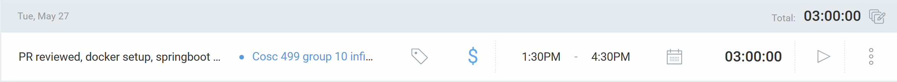
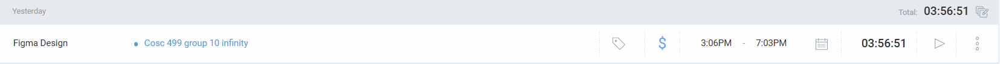
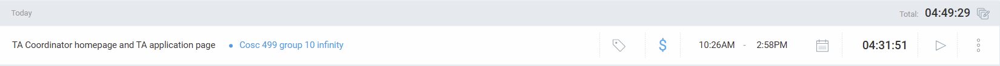
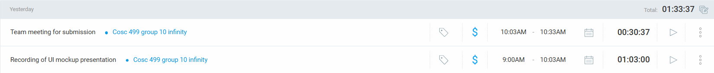

## 19 May, Monday 10:00AM–12:30PM  
### Timesheet

**Clockify:** 
### Current Tasks  
- **#1:** Team Charter (Completed in the team meeting and reviewed with team simultaneously)  
- **#2:** Clockify Setup (Completed during meeting)  

### Progress Update  
| TASK/ISSUE # | STATUS     |  
|--------------|------------|  
| Task A       | Completed  |  
| Task B       | Completed  |  

### Cycle Goal Review  

**Reflection**  
During this cycle, we successfully completed Task A (Team Charter), which helped define the scenarios clearly. Also completed setup on Clockify.  

**Retrospective**  
The overall process is progressing steadily. We allocated more time for team discussions for Wednesday, 21 May from 10:00AM–12:00PM.  

### Next Cycle Goals  
- **Task A:** Project Planning  

----------------------------------------------------------------------------------------------------------------------------------------------------------------------------------------------------------------------------------------------------

## 21 May, Wednesday 10:00AM–12:30PM  
### Timesheet
**Clockify:** 

### Current Tasks  
- **#1:** FR, User, and NFR requirements (Completed in team meeting and reviewed)  
- **#2:** High Risk (Wrote in document)  
- **#3:** Assumptions and Constraints (Wrote in document)  

### Progress Update  
| TASK/ISSUE # | STATUS     |  
|--------------|------------|  
| Task A       | Completed  |  
| Task B       | Pending (Team discussion needed) |  
| Task C       | Pending (Team discussion needed) |  

### Cycle Goal Review  

**Reflection**  
Successfully completed Task A (Functional, User, and Non-Functional Requirements), which helped define the system’s expected behavior. Task B (High Risk) and Task C (Assumptions and Constraints) remain pending due to the need for further team input.  

**Retrospective**  
The overall process is steady. More time was allocated for team discussions on Thursday, 22 May from 12:00PM–2:00PM.  

### Next Cycle Goals  
- **Task 1:** Teamwork Planning and Anticipated Hurdles  
- **Task 2:** High-level project description and boundaries  
- **Task 3:** Users, Usage Scenarios and High-Level Requirements  

----------------------------------------------------------------------------------------------------------------------------------------------------------------------------------------------------------------------------------------------------

## 22 May, Thursday 12:00PM–2:00PM  
### Timesheet

**Clockify:** 

### Current Tasks  
- **#1:** User Scenarios  
- **#2:** MVP  
- **#3:** High-Level Project Description and Boundaries  

### Progress Update  
| TASK/ISSUE # | STATUS     |  
|--------------|------------|  
| Task 1       | Completed  |  
| Task 2       | Completed  |  
| Task 3       | Completed  |  

### Cycle Goal Review  

**Reflection**  
Completed all tasks as planned, contributing to a clear definition of the system's behavior and structure.  

**Retrospective**  
Progress continues steadily. More time was allocated for team discussions on Friday after class.  

### Next Cycle Goals  
- **Task 1:** Review of Project Plan  

----------------------------------------------------------------------------------------------------------------------------------------------------------------------------------------------------------------------------------------------------

## 26 May, Monday 12:00PM–2:00PM  
### Timesheet

**Clockify:** 

### Current Tasks  
- **#1:** Converted user stories into KANBAN  
  - Added descriptions and followed team’s user story format  

### Progress Update  
| TASK/ISSUE # | STATUS     |  
|--------------|------------|  
| Task 1       | Completed  |  

### Cycle Goal Review  

**Reflection**  
Successfully completed Task A, which helped define the system’s expected behavior more precisely.  

**Retrospective**  
Progress is steady. Additional discussion time was scheduled for Tuesday after class.  

### Next Cycle Goals  
- **Task 1:** Towards next milestone and submission of project plan  

----------------------------------------------------------------------------------------------------------------------------------------------------------------------------------------------------------------------------------------------------

## 27 May, Tuesday 1:30PM–4:30PM  
### Timesheet

**Clockify:** 

### Current Tasks  
- **#1:** Reviewed PR related to backend setup  
- **#2:** Watched Spring Boot tutorials on YouTube  
- **#3:** Setup Docker with frontend and backend containers  

### Progress Update  
| TASK/ISSUE # | STATUS     |  
|--------------|------------|  
| Task 1       | Completed  |  
| Task 2       | Completed  |  
| Task 3       | Completed  |  

### Cycle Goal Review  

**Reflection**  
Completed all setup-related tasks. These initial steps are crucial for the development workflow and backend integration.  

**Retrospective**  
Process is progressing well. More discussion time was scheduled for Friday after class.  

### Next Cycle Goals  
- **Task 1:** Towards next milestone (wireframes, diagrams such as DFD, ER, etc.)

----------------------------------------------------------------------------------------------------------------------------------------------------------------------------------------------------------------------------------------------------

## 28 May, Wednesday 11:15AM–3:51PM  
### Timesheet

**Clockify:** 

### Current Tasks  
- **#1:** Designed the Login Page UI in Figma  
- **#2:** Designed the Signup Page UI in Figma  

### Progress Update  
| TASK/ISSUE # | STATUS     |  
|--------------|------------|  
| Task 1       | Completed  |  
| Task 2       | Completed  |  

### Cycle Goal Review  

**Reflection**  
During this cycle, I completed the initial design for both the login and signup pages in Figma. These screens follow the planned layout and visual hierarchy and are aligned with the user stories for account management.  

**Retrospective**  
The design process went smoothly, and working within Figma helped visualize user interaction early. Future iterations may include usability testing or applying consistent color themes with the rest of the system.  

### Next Cycle Goals  
- **Task 1:** Finalize homepage wireframe and instructor dashboard UI.

----------------------------------------------------------------------------------------------------------------------------------------------------------------------------------------------------------------------------------------------------

## 29 May, Thursday 12:30PM–4:00PM  
### Timesheet

**Clockify:** 

### Current Tasks  
- **#1:** Designed the TA Dashboard Page in Figma  
- **#2:** Designed the Instructor Dashboard Page in Figma  

### Progress Update  
| TASK/ISSUE # | STATUS     |  
|--------------|------------|  
| Task 1       | Completed  |  
| Task 2       | Completed  |  

### Cycle Goal Review  

**Reflection**  
This cycle focused on designing the TA and Instructor dashboard pages in Figma. Both pages were structured based on user roles and their respective functionalities, including visual access to schedules, applications, and course needs.  

**Retrospective**  
The design decisions were guided by the feedback from team discussions. Designing from the perspective of different user roles helped clarify layout priorities. Additional input from teammates will be gathered before finalizing the layout and interactions.

### Next Cycle Goals  
- **Task 1:** Begin Student dashboard design with emphasis on their tasks.

-------------------------------------------------------------------------------------------------------------------------------------------------------------------------------------

## 31 May, Saturday 1.05PM–2:52PM  
### Timesheet

**Clockify:** 

### Current Tasks  
- **#1:** Designed Instructor pages (Home, Profile) in Figma  

### Progress Update  
| TASK/ISSUE # | STATUS     |  
|--------------|------------|  
| Task 1       | Completed  |  

### Cycle Goal Review  

**Reflection**  
This cycle focused on designing the Instructor pages (Home and Profile) in Figma. Both pages were structured around core functionalities relevant to instructors, such as managing course needs and viewing current teaching assignments.

**Retrospective**  
The design decisions were guided by feedback from team discussions. Creating layout designs from the instructor’s perspective helped prioritize features effectively. Final refinements will be based on additional team feedback before implementation.

### Next Cycle Goals  
- **Task 1:** Design TA Allocations page  
- **Task 2:** Design Course Requirement page  

-------------------------------------------------------------------------------------------------------------------------------------------------------------------------------------

## 1 June, Sunday 3:06PM–7:03PM  
### Timesheet

**Clockify:** 

### Current Tasks  
- **#1:** Designed TA Allocations page  
- **#2:** Designed Course Requirement page  

### Progress Update  
| TASK/ISSUE # | STATUS     |  
|--------------|------------|  
| Task 1       | Completed  |  
| Task 2       | Completed  |  

### Cycle Goal Review  

**Reflection**  
This cycle focused on designing the TA Allocations and Course Requirement pages. These designs were centered around the coordinator and instructor workflows, ensuring functionality like assigning TAs and defining course-specific needs was intuitive and clearly displayed.

**Retrospective**  
Team feedback played a key role in shaping these pages. Aligning design elements with user stories made it easier to structure the interface logically. Further peer feedback will help polish these layouts.

### Next Cycle Goals  
- **Task 1:** Design TA Application page  
- **Task 2:** Design TA Coordinator homepage  

-------------------------------------------------------------------------------------------------------------------------------------------------------------------------------------
## 2 June, Monday 10:26AM–2:58PM  
### Timesheet

**Clockify:** 

### Current Tasks  
- **#1:** Designed TA Application page  
- **#2:** Designed TA Coordinator homepage  

### Progress Update  
| TASK/ISSUE # | STATUS     |  
|--------------|------------|  
| Task 1       | Completed  |  
| Task 2       | Completed  |  

### Cycle Goal Review  

**Reflection**  
This cycle focused on designing the TA Application and TA Coordinator homepage. These pages were structured to support coordinator workflows, allowing effective browsing of TA applicants and administrative access to platform functionalities.

**Retrospective**  
Designs were shaped by user stories and refined with input from teammates. Building from the coordinator's perspective helped clarify key layout and interaction needs. Additional feedback will guide final iterations.

### Next Cycle Goals  
- **Task 1:** Design Course Management page  
- **Task 2:** Design TA Allocations page  

-------------------------------------------------------------------------------------------------------------------------------------------------------------------------------------
## 2 June, Monday 11:01PM–12:37AM  
### Timesheet

**Clockify:** 

## Current Tasks  
- **#1:** Design and implement TA Allocation page

## Progress Update  
| TASK/ISSUE # | DESCRIPTION                          | STATUS     |  
|--------------|--------------------------------------|------------|  
| Task 1       | Created a detailed UI for the TA Allocation page, including course/applicant filters, results section, and availability calendar | Completed  |

## Cycle Goal Review  

### Reflection  
This sprint focused on designing the TA Allocation page to support the core responsibilities of the TA Coordinator. The page was designed to allow easy filtering and comparison of course requirements and TA applications. Key functionalities include:

- **Course Filter**: Search courses by name, department code, section, and term.
- **Applicant Filter**: Filter TA applicants based on their top course preferences, term, and requested hours.
- **Results Section**: Displays matching courses and applicants. Selection of a course and applicant reveals relevant information including prerequisites, grading hours, and schedule.
- **Weekly Calendar**: A dynamic visual showing the overlap between course schedules and TA availability using colored time slots. Conflicts can be highlighted for clarity.

The goal was to simplify TA allocation decisions by presenting all necessary data on a single page in a clear and interactive format.

### Retrospective  
The design was based on user stories defined earlier in the project. Input from peers was integrated to ensure the layout matched coordinator workflows. Visual hierarchy and intuitive filters were emphasized. 

### Next Cycle Goals  
- **Task 1:**  Student dashboard pages 

-------------------------------------------------------------------------------------------------------------------------------------------------------------------------------------
## 2 June, Monday 11:01PM–12:37AM  
### Timesheet

**Clockify:** 

## Current Tasks  
- **#1:** Design and implement TA Allocation page

## Progress Update  
| TASK/ISSUE # | DESCRIPTION                          | STATUS     |  
|--------------|--------------------------------------|------------|  
| Task 1       | Created a detailed UI for the TA Allocation page, including course/applicant filters, results section, and availability calendar | Completed  |

## Cycle Goal Review  

### Reflection  
This sprint focused on designing the TA Allocation page to support the core responsibilities of the TA Coordinator. The page was designed to allow easy filtering and comparison of course requirements and TA applications. Key functionalities include:

- **Course Filter**: Search courses by name, department code, section, and term.
- **Applicant Filter**: Filter TA applicants based on their top course preferences, term, and requested hours.
- **Results Section**: Displays matching courses and applicants. Selection of a course and applicant reveals relevant information including prerequisites, grading hours, and schedule.
- **Weekly Calendar**: A dynamic visual showing the overlap between course schedules and TA availability using colored time slots. Conflicts can be highlighted for clarity.

The goal was to simplify TA allocation decisions by presenting all necessary data on a single page in a clear and interactive format.

### Retrospective  
The design was based on user stories defined earlier in the project. Input from peers was integrated to ensure the layout matched coordinator workflows. Visual hierarchy and intuitive filters were emphasized. 

### Next Cycle Goals  
- **Task 1:**  Student dashboard pages 

-------------------------------------------------------------------------------------------------------------------------------------------------------------------------------------

## 3 June, Tuesday 10.10AM–12:15PM   & 2:16PM - 6:10PM  & 10:15PM-11:03PM
### Timesheet

**Clockify:** 

## Current Tasks  
- **#1:** Expanded user stories into sub-issues with the team  
- **#2:** Designed TA Homepage, My Courses, and Application Submission pages in Figma  
-**#3:** Prepared slides for the UI mockups
---

## Progress Update  
| TASK/ISSUE # | DESCRIPTION                                                                                       | STATUS     |  
|--------------|---------------------------------------------------------------------------------------------------|------------|  
| Task 1       | Collaborated with the team to break down the TA allocation feature into specific sub-issues       | Completed  |  
| Task 2       | Designed TA-side pages in Figma: TA Homepage, My Courses, and Application Submission UI screens   | Completed  |  

---

## Cycle Goal Review  

### Reflection  
This cycle focused on refining the TA experience in the portal by designing user-facing pages. These included a dashboard for TAs, a course overview, and an intuitive application form. The designs are clean, UBC-branded, and maintain consistency with coordinator views.

- **TA Homepage**: Summarizes all applied and accepted courses with clear status indicators and links to details.
- **My Courses Page**: Displays all assigned courses per term with schedule, instructor, grading hours, and TA status.
- **Application Submission**: Allows TAs to input course preferences, availability, hours requested, upload transcripts, and specify completed courses.

Together, these pages streamline the TA workflow from application to course assignment.

### Retrospective  
This sprint improved visual consistency across user roles and clarified the TA’s interaction model. Peer feedback guided the layout refinement and ensured feature coverage. Coordination with the team helped ensure that backend requirements aligned with frontend expectations.

---

## Next Cycle Goals  
- **Future Task:** Record a video walkthrough/mockup demonstration of all pages designed so far

-------------------------------------------------------------------------------------------------------------------------------------------------------------------------------------

## 4 June, Wednesday 9.00AM–10:03PM   &  10:03PM-10:33PM
### Timesheet

**Clockify:** 

## Current Tasks  
- **#1:** Recorded video walkthrough of UI mockups  
- **#2:** Team meeting to finalize and discuss UI mockups for submission  

---

## Progress Update  
| TASK/ISSUE # | DESCRIPTION                                                                  | STATUS     |  
|--------------|-------------------------------------------------------------------------------|------------|  
| Task 1       | Recorded a complete video walkthrough of the TA UI pages using snippet      | Completed  |  
| Task 2       | Collaborated with team to finalize mockup slides and discuss next steps       | Completed  |  

---

## Cycle Goal Review  

### Reflection  
This cycle focused on wrapping up the design by producing paper nd team meeting to finalize the submission package. 

### Retrospective  
The walkthrough added clarity and value by visually conveying the user experience. The team meeting helped gather final feedback and allowed alignment on the UI narrative and submission flow. All deliverables were reviewed and finalized collaboratively.

## Next Cycle Goals  
- **#1:** Frontend routing and backend setup

-------------------------------------------------------------------------------------------------------------------------------------------------------------------------------------

## 5 June, Thursday 12.41PM–3:12PM  
### Timesheet

**Clockify:** 

## Current Tasks  
- **#1:** Merged PR for frontend routing and backend setup
 
## Progress Update  
| TASK/ISSUE # | DESCRIPTION                                                                  | STATUS     |  
|--------------|-------------------------------------------------------------------------------|------------|  
| Task 1       | Setup done by merging PR for frontend and backend, got on call with Alex     | Completed  |  
 

## Cycle Goal Review  

### Reflection  
This cycle focused on the setup of frontend and backend as its little learning cuurve for the new frame, got some help from tutorials and alex to finish this setup

### Retrospective  
This cycle was primarily focused on the technical setup of the frontend and backend environments. There was a learning curve due to the new frameworks and tools, but collaboration with teammates (especially Alex) and the use of online tutorials helped overcome setup challenges. Getting the routing and build processes to work correctly across Docker, Spring Boot, and Vite was an essential milestone. The merged PR ensured all services were aligned and ready for further development. The support and pair programming session added clarity and made the process much smoother.

## Next Cycle Goals  
- **#1:** Login frontend part

-------------------------------------------------------------------------------------------------------------------------------------------------------------------------------------

## 5 June, Thursday 3.13PM–3:55PM   & 10:38PM-11:45PM

### Timesheet

**Clockify:**  
## Current Tasks  
- **#1:** Weekly Team logs
 
## Progress Update  
| TASK/ISSUE # | DESCRIPTION                                                                  | STATUS     |  
|--------------|-------------------------------------------------------------------------------|------------|  
| Task 1       |Weekly log completed for team, prepared presentation for meeting on firday    | Completed  |  
 

## Cycle Goal Review  

### Reflection  
I finalized the team log and prepared a presentation for Friday’s meeting. These tasks helped align our work, clarified progress, and ensured we’re ready to present confidently.

### Retrospective  
The log and presentation were completed on schedule. While effective, we could enhance preparation by involving more team members earlier and updating logs more frequently to reduce last-minute effort.

## Next Cycle Goals  
- **#1:** Login frontend part

-------------------------------------------------------------------------------------------------------------------------------------------------------------------------------------
## 6 June, Friday 10.10AM–1:17PM 

**Clockify:** 
## Current Tasks  
- **#1:** Team meeting and helped seiya in setup backend and frontend 
## Progress Update  
| TASK/ISSUE # | DESCRIPTION                                                                  | STATUS     |  
|--------------|-------------------------------------------------------------------------------|------------|  
| Task 1       | Team meeting and helped seiya in setup backend and frontend                 | Completed  |  
 

## Cycle Goal Review  

### Reflection  
Supported Seiya with backend and frontend setup, ensuring Spring Boot and React were correctly configured. The collaboration improved team productivity and deepened understanding of full-stack project structure and integration.

### Retrospective  
The setup went smoothly and teamwork was effective. Future setups can be faster with clearer step-by-step guides and pre-documented environment requirements to help team members avoid common configuration issues.

## Next Cycle Goals  
- **#1:** Header and Footer Components

-------------------------------------------------------------------------------------------------------------------------------------------------------------------------------------
## 8 June, Sunday 10.10AM–1:17PM 

**Clockify:** 
## Current Tasks  
- **#1:** Coded header and footer as reusable components in react with testing 
## Progress Update  
| TASK/ISSUE # | DESCRIPTION                                                                  | STATUS     |  
|--------------|-------------------------------------------------------------------------------|------------|  
| Task 1       |     Coded header and footer as reusable components in react with testing          | Completed  |  
 

## Cycle Goal Review  

### Reflection  
I developed the header and footer as reusable components in React to maintain a consistent layout throughout the application. I structured them using functional components and styled them with Tailwind CSS. To ensure these components worked reliably, I also wrote unit tests to verify their rendering and behavior. Creating these reusable elements not only streamlined future development but also helped establish a cleaner codebase. This task enhanced my understanding of component reusability, modular design, and test-driven development in a React environment.

### Retrospective  
While coding the header and footer components, I ensured they were modular and reusable, which will save time during future UI development. Writing tests early gave me confidence in their stability. However, I could have involved teammates earlier for feedback on design consistency and accessibility. In future UI work, I plan to create shared style guidelines and documentation to support consistent design patterns. Overall, this task was productive and contributed significantly to the maintainability of our frontend codebase.

## Next Cycle Goals  
- **#1:** Login frontend page

-------------------------------------------------------------------------------------------------------------------------------------------------------------------------------------
## 8 June, Sunday 10.10AM–1:17PM 

**Clockify:** 
## Current Tasks  
- **#1:** Login page in react with testing 
## Progress Update  
| TASK/ISSUE # | DESCRIPTION                                                                  | STATUS     |  
|--------------|-------------------------------------------------------------------------------|------------|  
| Task 1       |        Login page in react with testing                                     | Completed  |  
 

## Cycle Goal Review  

### Reflection  
I built the login page using React, focusing on a responsive layout and intuitive user experience. The form includes controlled components for managing user input, and I implemented basic frontend validation for required fields. To ensure stability, I also wrote unit tests verifying correct rendering and input behavior. This task helped reinforce best practices in form handling, state management, and test-driven development, and it contributes to a more reliable and user-friendly authentication process within the application.

### Retrospective  
The login page was successfully implemented with a clean design and working tests. I ensured the form structure was modular and easily extendable. However, in future iterations, I could improve by adding real-time validation feedback, handling error states more gracefully, and integrating with backend authentication for a complete flow. Involving teammates early for UI/UX feedback and conducting user testing would also help catch design or usability issues early, ensuring the login page meets both functional and accessibility standards.

## Next Cycle Goals  
- **#1:** Signup Page

-------------------------------------------------------------------------------------------------------------------------------------------------------------------------------------
## 9 June, Monday 10.10AM–1:17PM 

**Clockify:** 
## Current Tasks  
- **#1:** Integration of frontend and backend discussed with Alex, Meeting
## Progress Update  
| TASK/ISSUE # | DESCRIPTION                                                                  | STATUS     |  
|--------------|-------------------------------------------------------------------------------|------------|  
| Task 1       |         Integration of frontend and backend discussed with Alex, Meeting      | Completed  |  
 

## Cycle Goal Review  

### Reflection  
I participated in a discussion with Alex to plan the integration of the frontend and backend for our project. We focused on aligning the API endpoints between the React frontend and Spring Boot backend. This meeting clarified how data would flow between components and services, helping us avoid future mismatches. It also gave me a clearer picture of where each part fits into the system, strengthening my understanding of full-stack communication and project structure.

### Retrospective  
During the meeting with Alex, we discussed the technical steps needed to integrate the React frontend with the Spring Boot backend. The session was informative, but we could have documented the integration plan more clearly for future reference. Creating a shared API contract earlier would help prevent discrepancies. In future meetings, I’ll propose documenting action items and diagrams.

## Next Cycle Goals  
- **#1:** Signup Page

-------------------------------------------------------------------------------------------------------------------------------------------------------------------------------------
## 9 June, Monday 1.49PM–3:17PM 

**Clockify:** 
## Current Tasks  
- **#1:** Nav bar component with tests
## Progress Update  
| TASK/ISSUE # | DESCRIPTION                                                                  | STATUS     |  
|--------------|-------------------------------------------------------------------------------|------------|  
| Task 1       |        Nav bar component with tests                                           | Completed  |  
 

## Cycle Goal Review  

### Reflection  
I developed a responsive and reusable Nav Bar component in React to enhance site navigation and user experience. Using Tailwind CSS, I ensured it fit seamlessly with the existing UI. I also wrote unit tests to verify its structure, links, and behavior across different screen sizes. This work improved my skills in building modular UI components and reinforced the importance of testing in maintaining consistent, error-free functionality as the application evolves.

### Retrospective  
While building the Nav Bar component, I focused on reusability, responsiveness, and test coverage. The implementation went well, but in hindsight, I could have gathered early feedback from the team to align design preferences and navigation structure. In future component development, I plan to involve peers earlier and document key decisions. 

## Next Cycle Goals  
- **#1:** Signup Page