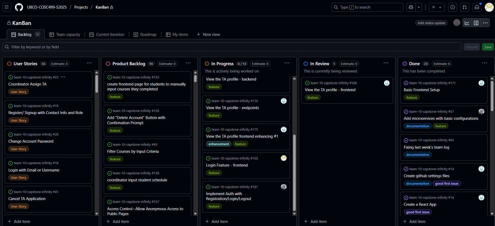

# Weekly Team Log

## Date Range:

- 6/2-6/5

## Features in the Project Plan Cycle:

- Project Design (Use Case, DFD, Database Design, UI design, System Architecture) finalization and video presentation
- Environment Setup : Docker and Springboot both frontend and backend

## Associated Tasks from Project Board:

| Task ID | Description        | Feature   | Assigned To | Status   |
| ------- | ------------------ | --------- | ----------- | -------- |
| [#56]   | UI Wireframe | Project Design | Mandeep, Eddy  | Completed |
| [#57]   | Add microservices with basic configurations | Backend setup | Alex  | Completed |
| [#12]   | Use Case Diagram | Project Design | Dup, Aakash  | Completed |
| [#11]   | Data Flow Diagram | Project Design | Allen, Seiya  | Complete |
| [#59]   | Project Design | Database Design | Dup, Alex | Complete |
| [#64]   | Project Design | System Architecture Diagram | Dup, Alex, Allen | Complete |
| [#176]  | Video Presentation | Project design document video| Mandeep, Dup , Alex, Aakash, Seiya, Alex, Allen| Complete|

### Alternatively, include image of the project board with tasks and status:

## Tasks for Next Cycle:

| Task ID | Description        | Estimated Time (hrs) | Assigned To |
| ----------- | ------------ | ------------ | ------------ |
| #103, #161 | Login/Logout tested and completed | 18 hours | a pair of two people |
| #168, #165 | View the TA profile | 18 hours | a pair of two people |
|  #32 | Browse all course  | 24 hours | 3 people |

### Alternatively, include image of the project board with tasks and status:

## Burn-up Chart (Velocity):

- ![docs/weekly logs/Burn Up Charts/[Burn Up Chart Image]](week3_images/burnup.png)

## Times for Team/Individual:
 Screenshot of Chart below taken at 11.17 PM on June 5:
| Team Member | Logged Hours |
| ----------- | ------------ |
| Aakash      | 13:36   |
| Alex      | 20:43     |
| Allen      | 9:09      |
| Dup      | 25:25      |
| Eddy      | 0:00      |
|   Mandeep      | 17:39      |
|   Seiya      |   12:29    |

- ![docs/weekly logs/Clockify/[Time Tracking Image]](week3_images/image.png)

## Completed Tasks:

| Task ID | Description        | Completed By |
| ------- | ------------------ | ------------ |
| [#57]   | Add microservices with basic configurations | Alex | 
| [#171]   | Basic frontend setup  | Dup | 

## In Progress Tasks/ To do:

| Task ID | Description        | Assigned To |
| ------- | ------------------ | ----------- |
| [#103]   | Login page frontend | Mandeep |
| [#161]   | Implement Auth with registration/login/logout| Alex|
| [#171]   |View the TA profile frontend enhancing #1| Dup|
| [#169]   | View the TA profile - backend| Aakash|
| [#32]   |  Browse All courses backend  | Allen |
| [#32]   | Browse All courses frontend| Seiya |

## Test Report / Testing Status:

N/A.

## Overview:

During the week of June 3 to June 5, the team successfully wrapped up the Project Design cycle, which included finalizing the Use Case Diagram, DFD, Database Schema, UI Wireframes, and System Architecture. These were reviewed, documented, and compiled into a video presentation submitted as part of the deliverables. The environment setup was also completed, with both frontend and backend configured using Docker and Spring Boot.

Several tasks were marked as completed, such as basic microservice configuration, frontend initialization, and all major components of the project design phase. Team members actively contributed and logged a range of hours as tracked in Clockify, with notable efforts from Dup and Alex.

Looking ahead, the team is transitioning into feature implementation, starting with authentication flows (Login/Logout/Register) and TA application submission. These tasks are now assigned and estimated in hours to guide the next development cycle. Some frontend and backend components are in progress, with individuals already taking ownership of specific features.