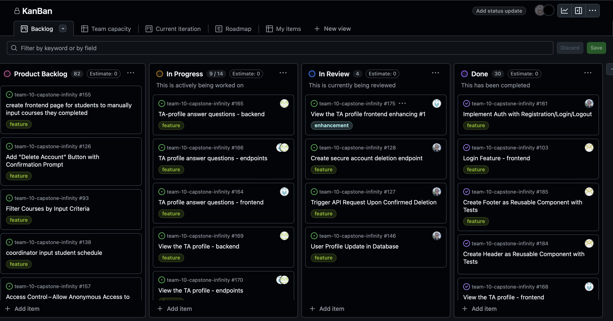

# Weekly Team Log

## Date Range:

- 6/06-6/09

## Features in the Project Plan Cycle:

- Login Page With Auth
- View TA Profile
- Browse All Courses

## Associated Tasks from Project Board:

| Task ID | Description        | Feature   | Assigned To | Status   |
| ------- | ------------------ | --------- | ----------- | -------- |
| [#112]   | Login feature - backend | LoginFeature | Alex  | Completed |
| [#83]   | Registering Backend| RegisterFeature | Alex  | Completed |
| [#81]   | Registering Endpoints | RegisterFeature | Alex | Completed |
| [#109]   | Login feature - endpoints | LoginFeature | Alex  | Complete |
| [#171]   | Basic Frontend Setup | BasicFrontEnd | Dup | Complete |
| [#168]   | View the TA profile - frontend | TAprofile | Dup | Complete |
| [#184]  | Create header as reusable component with tests | BasicFrontEnd| Mandeep| Complete|
| [#185]  | Create footer as reusable component with tests | BasicFrontEnd| Mandeep| Complete|
| [#103]  | Login feature - frontend | LoginFeature | Mandeep| Complete|
| [#161]  | Implement Auth with login/logout/register | LoginFeature | Alex| Complete|
| [#165]  | TAprofile answer questions - backend | TAprofile | Aakash | In Progress |
| [#166]  | TAprofile answer questions - endpoints | TAprofile | Aakash | Complete |
| [#169]  | View the TAprofile - backend| TAprofile | Aakash | Complete |
| [#170]  | View the TAprofile - endpoints | TAprofile | Aakash | Complete |
| [#164]  | TAprofile answer questions - frontend | TAprofile | Dup | In Progress |
| [#189]  | Create Navbar as reusable feature | FrontEnd | Mandeep | In Progress |
| [#80]  | Registering - frontend | RegisterFeature | Mandeep | In Progress | 
| [#191]  | View TAprofile - enhancing aesthetics | TAprofile | Dup | In Progress |
| [#93]  | Filter courses by input criteria - backend + frontend | BrowseAllCourses | Allen & Seiya | In Progress |
| [#98]  | Integrate React with Spring Boot for Course Filtering - backend + frontend | BrowseAllCourses | Allen & Seiya | In Progress |
| [#82]  | Course Filters and Filter Button - backend + frontend | BrowseAllCourses | Allen & Seiya | In Progress |

### Alternatively, include image of the project board with tasks and status:

## Tasks for Next Cycle:

| Task ID | Description        | Estimated Time (hrs) | Assigned To |
| ----------- | ------------ | ------------ | ------------ |
| Multiple Task IDs | All of the Instructor's input features related to TA-allocation (such as updating what courses the instructors need TAs for) tested and completed.  | 30 hours | Group of 3 people |
| Multiple Task IDs | TA Applications | 30 hours | Group of 3 people |

### Alternatively, include image of the project board with tasks and status:

## Burn-up Chart (Velocity):

- ![docs/weekly logs/Burn Up Charts/[Burn Up Chart Image]](week4_images/burnup.png)

## Times for Team/Individual:
 Screenshot of Chart below taken at 11.30 PM on June 9:
| Team Member | Logged Hours |
| ----------- | ------------ |
| Aakash      |  20:32  |
| Alex      | 20:24 |
| Allen      | 9:18      |
| Dup      | 22:01      |
| Eddy      | 0:00      |
|   Mandeep      | 20:!5      |
|   Seiya      |   27:10   |

- ![docs/weekly logs/Clockify/[Time Tracking Image]](week4_images/image.png)

## Completed Tasks:

| Task ID | Description        | Completed By |
| ------- | ------------------ | ------------ |
| [#112]   | Login feature - backend | LoginFeature | Alex  | Completed |
| [#83]   | Registering Backend| RegisterFeature | Alex  |
| [#81]   | Registering Endpoints | RegisterFeature | Alex |
| [#109]   | Login feature - endpoints | LoginFeature | Alex  |
| [#171]   | Basic Frontend Setup | BasicFrontEnd | Dup |
| [#168]   | View the TA profile - frontend | TAprofile | Dup |
| [#184]  | Create header as reusable component with tests | BasicFrontEnd| Mandeep| 
| [#185]  | Create footer as reusable component with tests | BasicFrontEnd| Mandeep| 
| [#103]  | Login feature - frontend | LoginFeature | Mandeep| 
| [#161]  | Implement Auth with login/logout/register | LoginFeature | Alex| 
| [#166]  | TAprofile answer questions - endpoints | TAprofile | Aakash |
| [#169]  | View the TAprofile - backend| TAprofile | Aakash |
| [#170]  | View the TAprofile - endpoints | TAprofile | Aakash |

## In Progress Tasks/ To do:

| Task ID | Description        | Assigned To |
| ------- | ------------------ | ----------- |
| [#164]  | TAprofile answer questions - frontend | TAprofile | Dup |
| [#189]  | Create Navbar as reusable feature | FrontEnd | Mandeep |
| [#80]  | Registering - frontend | RegisterFeature | Mandeep |
| [#191]  | View TAprofile - enhancing aesthetics | TAprofile | Dup |
| [#93]  | Filter courses by input criteria - backend + frontend | BrowseAllCourses | Allen & Seiya |
| [#98]  | Integrate React with Spring Boot for Course Filtering - backend + frontend | BrowseAllCourses | Allen & Seiya |
| [#82]  | Course Filters and Filter Button - backend + frontend | BrowseAllCourses | Allen & Seiya |
| [#165]  | TAprofile answer questions - backend | TAprofile | Aakash |

## Test Report / Testing Status:

N/A.

## Overview:

During the week of Jun6 - Jun9, Alex and Mandeep worked on the backend and frontend of Login page with auth having completed most of the assigned tasks. Some minor changes and tasks are remaining which will be completed tomorrow in our in-person meeting.
Further, Aakash and Dup worked on the backend and frontend of View TA profile. They completed most of the assigned tasks, remaining of which will be completed tomorrow. Backend functionality is complete and frontend design is complete. Now, they just have to integrate the frontend with the backend. 
Lastly, Allen and Seiya worked on the backend and frontend of Browse all courses. They too have completed most of the functional requirements, only remaining part is the integration of backend with the frontend. 
