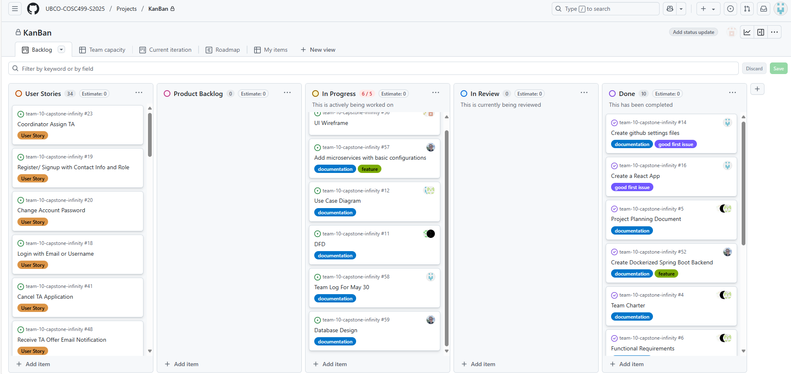

# Weekly Team Log

## Date Range:

- 5/18-5/29

## Features in the Project Plan Cycle:

- Project Planning (Function requirements, user requirements, team planning, UVP, etc)
- Project Design (Use Case, DFD, Database Design, UI design, System Architecture)
- Frontend and Backend setup

## Associated Tasks from Project Board:

| Task ID | Description        | Feature   | Assigned To | Status   |
| ------- | ------------------ | --------- | ----------- | -------- |
| [#5]   | Project Planning Document | Project Planning | All team members  | Comleted |
| [#52]   | Create Dockerized Spring Boot Backend | Backend setup | Alex  | Completed |
| [#16]   | Create a React App | Frontend setup | Dup  | Completed |
| [#57]   | Add microservices with basic configurations | Implemented microservices to project | Alex  | In progress |
| [#56,12,11,59]   | Project Design | Frontend setup | All Team members | In progress |

### Alternatively, include image of the project board with tasks and status:

## Tasks for Next Cycle:

| Task ID | Description        | Estimated Time (hrs) | Assigned To |
| ----------- | ------------ | ------------ | ------------ |
| N/A | Login/Logout tested and completed | 18 hours | a pair of two people |
| N/A | Register tested and completed | 18 hours | a pair of two people |
| N/A | TA-application by TA tested and completed | 24 hours | 3 people |

### Alternatively, include image of the project board with tasks and status:

## Burn-up Chart (Velocity):

- ![docs/weekly logs/Burn Up Charts/[Burn Up Chart Image]](week1_images/burnup.png)

## Times for Team/Individual:
 Screenshot of Chart below taken at 2:11 PM on May 29:
| Team Member | Logged Hours |
| ----------- | ------------ |
| Aakash      | 10:05    |
| Alex      | 44:49      |
| Allen      | 3:06      |
| Dup      | 28:39      |
| Eddy      | 0:31      |
|   Mandeep      | 13:36      |
|   Seiya      |   0    |

- ![docs/weekly logs/Clockify/[Time Tracking Image]](week1_images/clockify.png)

## Completed Tasks:

| Task ID | Description        | Completed By |
| ------- | ------------------ | ------------ |
| [#5]   | Project Planning Document | All team members | 
| [#52]   | Create Dockerized Spring Boot Backend | Alex | 
| [#16]   | Create a React App | Dup | 

## In Progress Tasks/ To do:

| Task ID | Description        | Assigned To |
| ------- | ------------------ | ----------- |
| [#57]   | Add microservices with basic configurations | Alex |
| [#56]   | (Project Design) UI wireframe| Mandeep, Eddy|
| [#12]   | (Project Design) Use case Diagram| Dup, Aakash|
| [#11]   | (Project Design) DFD| Seiya, Allen|
| [#59]   | (Project Design) Database Design| Alex |
| [N/A]   | (Project Design) System Architecture| undecided |

## Test Report / Testing Status:

N/A.
The application has not started yet. However, we did get Vitest installed in the front end, and Spring Boot testing installed in the backend.

## Overview:

The team focused on Project Planning. The Kanban Board has been populated with user stories and tasks, milestones have been added, and the dashboard visuals creation has been completed. The next cycle will focus on Project Design.
