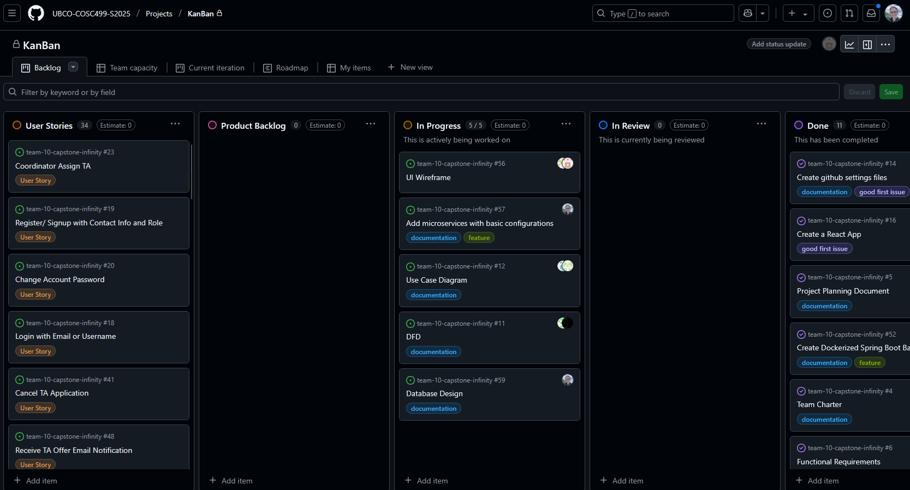

# Weekly Team Log

## Date Range:

- 5/30-6/2

## Features in the Project Plan Cycle:

- Project Design (Use Case, DFD, Database Design, UI design, System Architecture)
- Implementation of Microservices in the backend

## Associated Tasks from Project Board:

| Task ID | Description        | Feature   | Assigned To | Status   |
| ------- | ------------------ | --------- | ----------- | -------- |
| [#56]   | UI Wireframe | Project Design | Mandeep, Eddy  | Comleted |
| [#57]   | Add microservices with basic configurations | Backend setup | Alex  | 90% Completed |
| [#12]   | Use Case Diagram | Project Design | Dup, Aakash  | Completed |
| [#11]   | Data Flow Diagram | Project Design | Allen, Seiya  | Complete |
| [#59]   | Project Design | Database Design | Dup, Alex | Complete |
| [#64]   | Project Design | System Architecture Diagram | Dup, Alex, Allen | Complete |

### Alternatively, include image of the project board with tasks and status:

## Tasks for Next Cycle:

| Task ID | Description        | Estimated Time (hrs) | Assigned To |
| ----------- | ------------ | ------------ | ------------ |
| N/A | Login/Logout tested and completed | 18 hours | a pair of two people |
| N/A | Register tested and completed | 18 hours | a pair of two people |
| N/A | TA-application by TA tested and completed | 24 hours | 3 people |

### Alternatively, include image of the project board with tasks and status:

## Burn-up Chart (Velocity):

- ![docs/weekly logs/Burn Up Charts/[Burn Up Chart Image]](week2_images/burnup.png)

## Times for Team/Individual:
 Screenshot of Chart below taken at 8:02 PM on June 2:
| Team Member | Logged Hours |
| ----------- | ------------ |
| Aakash      | 4:29    |
| Alex      | 9:59      |
| Allen      | 0:56      |
| Dup      | 15:42      |
| Eddy      | 3:26      |
|   Mandeep      | 5:44      |
|   Seiya      |   3:32    |

- ![docs/weekly logs/Clockify/[Time Tracking Image]](week2_images/clockify.png)

## Completed Tasks:

| Task ID | Description        | Completed By |
| ------- | ------------------ | ------------ |
| [#14]   | Create github settings files | Dup | 

## In Progress Tasks/ To do:

| Task ID | Description        | Assigned To |
| ------- | ------------------ | ----------- |
| [#57]   | Add microservices with basic configurations | Alex |
| [#56]   | (Project Design) UI wireframe| Mandeep, Eddy|
| [#12]   | (Project Design) Use case Diagram| Dup, Aakash|
| [#11]   | (Project Design) DFD| Seiya, Allen|
| [#59]   | (Project Design) Database Design| Alex |
| [N/A]   | (Project Design) System Architecture| Dup, Alex, Allen |

## Test Report / Testing Status:

N/A.

## Overview:

The team focused on Project Design through creating diagrams and wireframes. We also started configuring the backend to use a microservice architecture.